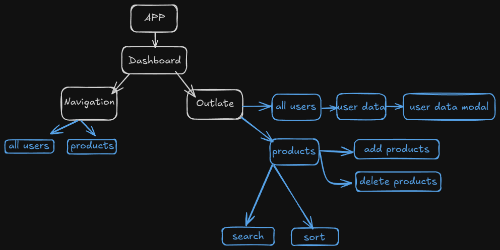

# Admin Dashboard

## Live Demo
Check out the live version of the project here: [Admin Dashboard](https://job-task-xbd-u2dk.vercel.app/)

## Overview

This project is a responsive **Admin Dashboard** built using **React** and styled with **Tailwind CSS**. It integrates with a RESTful API to display user and product data. The dashboard includes a sidebar for navigation and a main content area to view and manage users and products.

### Features:
- Displays a list of users fetched from the RESTful API.
- Displays product information, allows adding, viewing, and deleting products.
- Sorting and searching functionalities for users and products (bonus feature).
- Basic authentication to simulate user login.

## Technologies Used:
- **React**: A modern JavaScript library for building user interfaces.
- **Tailwind CSS**: A utility-first CSS framework for styling the application.
- **RESTful API**: Integration with the API to fetch, add, and delete users and products.
- **React Router**: For handling navigation between pages (users/products).

 **Basic Authentication**:  
   - Simulates a login system (for bonus points), protecting access to the dashboard.
   - Username is user
   - Password is password

## Installation

1. Clone the repository:
   ```bash
   git clone https://github.com/MUEID11/job_task_xbd.git
   cd colned folder
   npm install
   npm run dev
- Open your browser and go to http://localhost:5173 to view the application.

## Project outline

